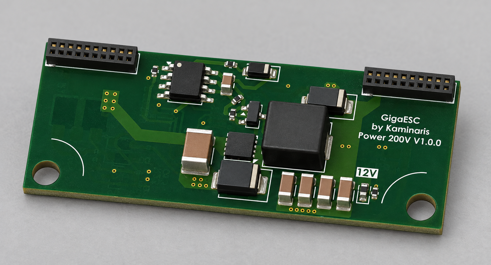
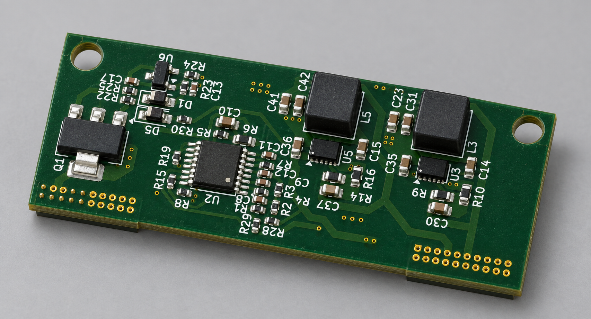

# GigaPower200V

Compact 50 × 20 mm non-isolated power-supply module for the modular GigaESC platform, intended for the 200 V version. Provides 12 V, 5 V and 3.3 V rails through a separate output connector.

## Board views

AI-generated photorealistic visualizations based on the PCB renders. Refer to the KiCad files for exact geometry.

## Hardware

- TL494 PWM controller, IR2181 gate driver and TL431 reference circuitry.
- Two AP63356DV buck regulators for the lower-voltage rails.
- Two 2×10 connectors separating input and output connections.
- Common ground between input and outputs; no galvanic isolation.

## Connector summary

| Connector | Pins | Signal |
|---|---|---|
| J1 input | 3, 5 | VIN |
| J1 input | 17–20 | GND |
| J2 output | 3, 4 | 12 V |
| J2 output | 7, 8 | 5 V |
| J2 output | 11, 12 | 3.3 V |
| J2 output | 1, 2, 5, 6, 9, 10, 13–16, 19, 20 | GND |

Remaining connector pins are unconnected in the schematic. Use the current schematic as the authoritative pinout.

## Project

Open `GigaPower200V.kicad_pro` in KiCad 10. Schematic and layout are in `GigaPower200V.kicad_sch` and `GigaPower200V.kicad_pcb`. Local libraries are included; keep the connector STEP model alongside the project.

The project name describes the intended voltage class, not a measured operating limit. Input range, output loading and thermal performance require hardware validation. The inherited `LM5164_DESIGN.md` describes an earlier design and is not documentation for the current TL494 implementation.
